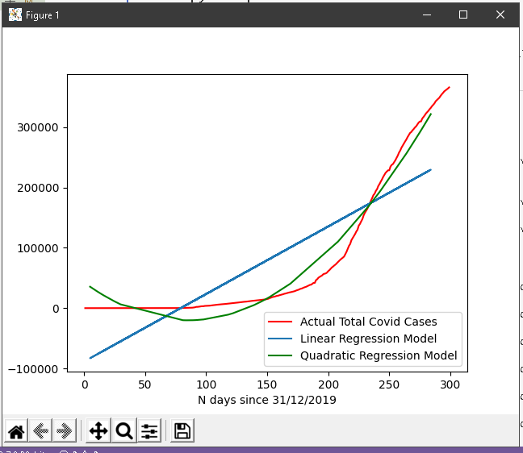

# Linear and Quadratic Regression Model for the COVID cases in Philippines

This is a simple implementation of linear regression model using the sckit learn and quadratic regression model using polyfit of numpy library. There is also plot of the different models against the actual total covid cases as of October 24,2020

**Few things to take note in this models:**
- It uses to two dimensions where the x is the number days since December 31,2019(so that the date can be processed in the algortihm) and the y is the total COVID cases of the Philippines
- The model assumes that the cases will not decrease anytime (I hope it will decrease sooner)
- Null values(or NaN) are replaced with 0 since null values can indicate that there are no recorded cases or no cases at all.
- Libraries used:
    - Numpy
    - Pandas
    - Matplotlib
    - Sckitlearn

**Output of the Script**

**Credits to ourworldindata.org for the dataset that I used**
Here is the link for their website and the download link for the dataset that I used: <https://ourworldindata.org/coronavirus/country/philippines?country=~PHL>

